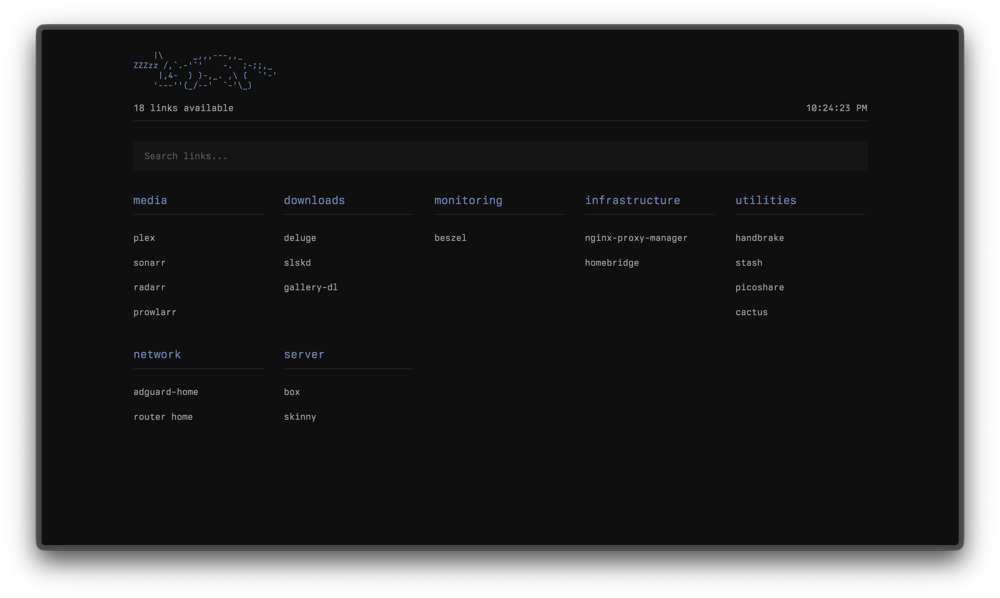

# Homepage

A customizable link dashboard for organizing and accessing a list of links or services. Written in vanilla HTML/CSS/JS, it is designed to be used with basically any web server.

Originally built to make accessing my self-hosted services from my homelab easier, but it can really be used to organize or create a dashboard with any sort of links.



## Features

-  A very minimal and terminal inspired design
-  Easy JSON based configuration
-  Search functionality
-  Documentation panel to show custom documentation (if available) for each link

## Quick Start

### Use a web server of your choice

*Example Python HTTP server*
`python3 -m http.server 8032`

and browse to http://localhost:8032

#### Configuration

Edit `default-config/links.json` to customize your links, and your documentation goes in `default-config/docs`.

### Use the included Nginx Dockerfile

*I use this to deploy it to my own homelab*

```bash
# Run with Docker
docker build -t homepage .
docker run -p PORT:80 homepage -v '/path/to/your/config/':'/config'
```

#### Configuration

The directory you select for configuration should include your `links.json`, and the docs should be in the root directory (not in the docs directory like the non-Docker deployment options). If no /config directory is specified, it will fall back to use the `links.json` in `default-config`.
